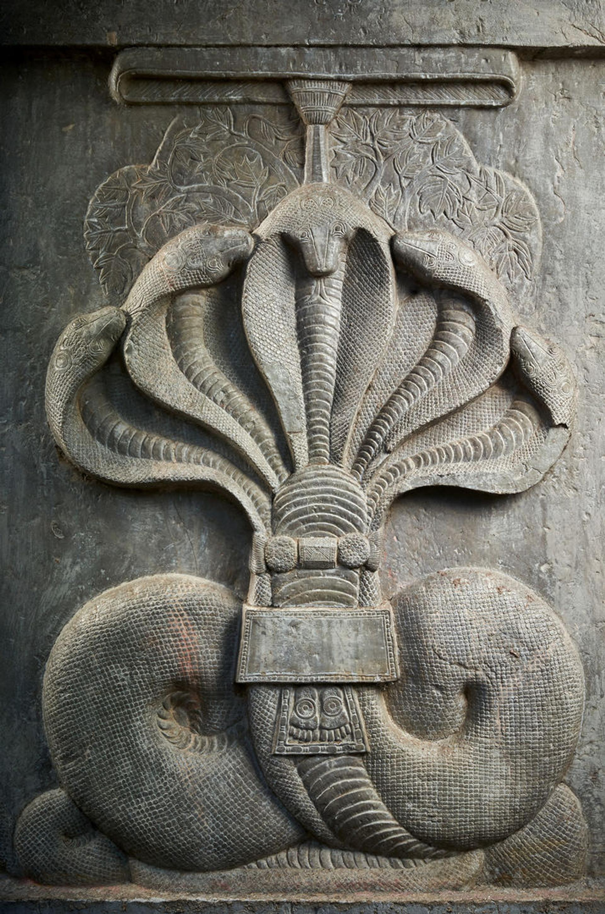

**IMAGE:** Detail of carved limestone figurative ornamentation drawn from a panel of an early Bauddhadharma stupa's 'architectural foundation' or 'medhi' (Sanskrit; English: 'drum \[architectural technical term]'), with [Sri Nagaraja Muchalinda](https://en.wikipedia.org/wiki/Mucilinda), with [Chhatra](https://en.wikipedia.org/wiki/Chatra_(umbrella)), fronting the [Bodhi Tree](https://en.wikipedia.org/wiki/Bodhi_tree), guarding a reliquary [Stupa](https://en.wikipedia.org/wiki/Stupa), surmounting the rectangualar architectural foundation or medhi, with the very early [aniconic](https://en.wikipedia.org/wiki/Aniconism) representation of the [Sri Bhuddhapada](https://en.wikipedia.org/wiki/Buddha_footprint) (with [Sri \[Sudarshana\] Chakra](https://en.wikipedia.org/wiki/Sudarshana_Chakra), [Auspicious Marks](https://en.wikipedia.org/wiki/Physical_characteristics_of_the_Buddha)) of the [Divya](https://en.wiktionary.org/wiki/%E0%A4%A6%E0%A4%BF%E0%A4%B5%E0%A5%8D%E0%A4%AF#Sanskrit) [Chakravartin](https://en.wikipedia.org/wiki/Chakravarti_(Sanskrit_term)), Bhagavan [Sri Gautama Shakyamuni](https://en.wikipedia.org/wiki/The_Buddha) [Samyaksambuddha](https://en.wikipedia.org/wiki/Buddhahood), the [Thus Come/Thus Gone One](https://en.wikipedia.org/wiki/Tath%C4%81gata) and an Incarnation and [Avatar](https://en.wikipedia.org/wiki/Avatar) of [Bhagavan Sri Vishnu](https://en.wikipedia.org/wiki/Vishnu). For me, Sri Muchalinda Naga has ever-been an incarnation of [Sri Nagaraja Anantha-Sesha](https://en.wikipedia.org/wiki/Shesha). Temporality: 1st century BCE-1st century CE. Provenance: Dhulikatta Stupa, [Dulikatta](https://en.wikipedia.org/wiki/Dhulikatta), [Karimnagar District](https://en.wikipedia.org/wiki/Karimnagar_district), [Telangana](https://en.wikipedia.org/wiki/Telangana), India. 
Lent by the Karimnagar Archaeology Museum, Karimnagar, Telangana. Copyright © The Metropolitan Museum of Art/Thierry Ollivier. Media & Materiality: Limestone masonry/carving. Dimensionality: H. 60 1/4 in. (153 cm); W. 45 1/4 in. (115 cm); D. 8 1/4 in. (21 cm). 

# hummingbird_homestead
A catchment and repository of my homesteading, home economics, culinary, preservation, medicinal, distillation, apothecary, brewing and gardening activities, knowledges and learnings of an embodied lifetime and my explorations of cultures, histories and anthropologies within this purview.
